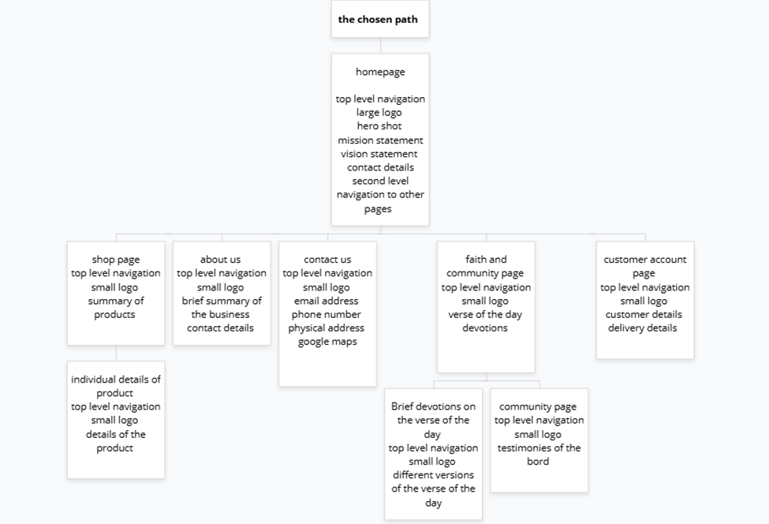

# 1.Project Title 
The chosen path website project 

# 2. Student details 
Name: Nobukhosi Andrieta Sibanda 
ST NUMBER: ST10496778

# 3. Project Overview 
The chosen path has asked me to ceate a website for their business, to increase sales and also be well established in the market 

# 4. Website goals and Objectives 
Goal 1: To inspire faith led living by creating a digital space that encourages the message of living a faith fueled life. 

Objective 1: To introduce a mobile first, easily navigable e-commerce platform that makes it easy for customers to browse through, buy and share merchandise and products of the business 

Goal 2: Build a Christ-centered community by connecting likeminded chindividuals to share testimonies and their values through our merchandise and products 

Objective 2: Raise brand awareness by using scripture- based message that appeals to the youth (Gen Z) audiences, compelling imagery and straight forward storytelling. 

Goal 3: Drive our sales with integrity by providing a stable, persistent, and ethical e-commerce experience that makes it possible to support the mission behind our brand. 

Objective 3: Link social media platforms (TikTok, Instagram etc.) to increase traffic, promote user-generated content, and expand your online presence.

Goal 4: Educate the youth (Gen Z) through scripture by integrating meaningful Bible content, such as Bible verses of the day, devotions etc. 

Objective 4: Optimize product pages, incorporate specials, and provide a seamless checkout experience to achieve steady monthly sales increase. 

Goal 5: Grow a loyal fanbase by turning first time customers into loyal customers by offering an experience that feels thoughtful and in tune with the word of God and his message. 

Objective 5: By continuously collecting reviews and customer feedback we build trust within the Christian Youth community and continue to spread the word through our merchandise and products. 

# 5. Key Features and Functionality 
Home page 
Slogan will appear directly under the logo 
Logo will appear on the top left side of the page 
Brief introduction of the business, read more button will be used to redirect to the about us page 
Image will be used in the background aligning to the business

Side bar to be used for it to be easy for customers 
A motivational hero banner with a marketing message or scripture on the homepage 
Buttons that prompt users to act
Emphasis on the brand's belief and vision 
Small snippet about us with a button to read the rest 
Button or emoticon to redirect customers to their carts 

 Shop page
1. Logo will appear on the top left side of the page 
2. Search bar appears at the top of the page 
3. Top navigation menu, to redirect to the choice of clothing wanted 
4. Product catalog with filter options (gender, size, and category) 
5. Button or emoticon to redirect customers to their carts
6. Individual product page 

Product details page that includes:

1.	Numerous outstanding photos 
2.	Scripture passage or spiritual significance of the design 
3.	Size chart 
4.	Reviews from customers 
5.	Button or emoticon to redirect customers to their carts

Faith and community features page

1.	Faith and fashion blog—behind the design capabilities, fashion tips, and brief devotions of the day
2.	Testimonies—accounts of customers with sincere stories on how the brand impacted their lives and Christian Walk and journey 
3.	Logo will appear on the top left page 
4.	Side bar will be accessible
5.	A social board or a prayer board for customers in distress 
6.	Button or emoticon to redirect customers to their carts

Features of the customer account page

1.	creating an account and logging in 
2.	Order tracking and history 
3.	Picks or a wish list 
4.	Preference and contacts saved 

About us page 

1. Logo appears on the left side of the page 
2. Top navigation bar 
3. Search bar 
4. Detailed explanations on the business will appear, with the history of the business included. 
5. Button or emoticon to redirect customers to their carts.
6. Google maps to direct the customers to the physical address of the business

Contact us page 

1. Email address appears
2. physical address appears 
3. small logo on the top left side of the page 
4. google maps link to physical address 

# 6. Timeline and milestones 
it will take 25 days for the project to be completed

# 7. site map

# 8. references 
Reference listd, n (2022). Triangle Leaf Cross  Logo Logo Maker | Design.com. [online] Design.com. Available at: https://www.design.com/maker/logo/9d53caa1-fafb-4488-95bf-f6d996550bba/draft/bddff4da-9e5e-46bf-850c-bd5f7ea4b157?savedDraft=True [Accessed 26 Aug. 2025].

d, n (2025a). Bible Reading Plans & Daily Devotionals | YouVersion Bible. [online] www.bible.com. Available at: https://www.bible.com/reading-plans [Accessed 27 Aug. 2025].

d, n (2025b). Figma. [online] Figma. Available at: https://www.figma.com/design/abSqtz5Lz1atmnqAokE1yd/Untitled?node-id=7-34&t=cKSmAkEfOBP7SqGr-0 [Accessed 26 Aug. 2025].

d, n (2025c). Image Resizer. [online] Imageresizer.com. Available at: https://imageresizer.com/resize/download/68af01234151e78922589c07 [Accessed 27 Aug. 2025].

Gilbert, N. (2019). What Is KPI and How to Measure It Effectively: Definition, Examples & Templates. [online] Financesonline.com. Available at: https://financesonline.com/what-is-kpi/ [Accessed 26 Aug. 2025].

gloomaps.com, G. (2018). GlooMaps - Visual Sitemap Tool. [online] Gloomaps.com. Available at: https://www.gloomaps.com/XokxtbYCkd [Accessed 27 Aug. 2025].